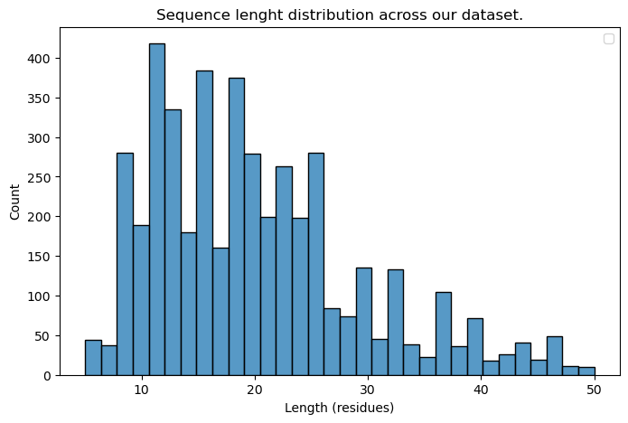
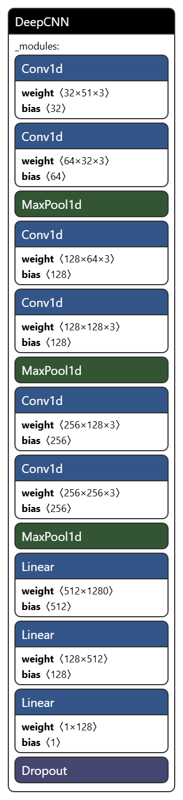
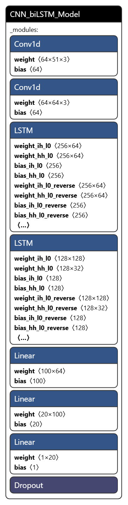

# Capstone Project
# AWS Machine Learning Engineer Nanodegree

**Omar Daniel Lopez Olmos**

**November 2024**

# Definition

## Project Overview

Antibiotics are crucial for treating infections and supporting immune-suppressing procedures. However, their overuse has led to multi-drug resistant bacteria, resulting in over 700,000 deaths annually. Antimicrobial peptides (AMPs) offer a promising alternative by targeting bacterial cell membranes and reducing the risk of drug resistance. Recent advancements in artificial intelligence, especially ML and DL, have improved the discovery and design of AMPs using peptide sequence data. Models like RNNs, VAEs, and GANs have shown success; but most of them focus on classifying whether an AMP has antimicrobial activity.

This project aims to develop regression systems to predict the minimum inhibitory concentration (MIC) of AMP sequences. The model specifically predicts the negative logarithmic MIC value (pMIC) against the common bacterial pathogen *Escherichia coli*.

## Problem statement

The goal is to develop a regressor that receives peptide sequences to predict their pMIC value. The main implementation design is an ensemble model. This ensemble model is built from scratch and specially designed to handle the inherent patterns of amino acid sequences. It is composed of CNN layers followed by bidirectional LSTM layers to extract both local and global dependencies in the amino acid sequence. The processed output will then be fed into a stack of linear layers to perform regression on the data.

## Metrics

Model performance was assessed by metrics commonly used in regression tasks: mean squared error (MSE), root mean squared error (RMSE) , mean absolute error (MAE), and the coefficient of determination ($R^2$): 

#### Mean Squared Error (MSE)
$$
MSE = \frac{1}{n} \sum_{i=1}^{n} (y_i - \hat{y}_i)^2
$$

#### Root Mean Squared Error (RMSE)
$$
RMSE = \sqrt{\frac{1}{n} \sum_{i=1}^{n} (y_i - \hat{y}_i)^2}
$$

#### Mean Absolute Error (MAE)
$$
MAE = \frac{1}{n} \sum_{i=1}^{n} |y_i - \hat{y}_i|
$$

#### Coefficient of Determination (R²)
$$
R^2 = 1 - \frac{SS_{\text{residual}}}{SS_{\text{total}}}
$$

where $n$ is the total number of predictions, $y_i$ is the actual experimental pMIC value, and $\hat{y}_i$ represents the predicted value for for prediction $i$. $SS_{\text{residual}}$ is the sum of squared residuals, which measures the variance of the errors between the actual values ($y_i$) and the predicted values ($\hat{y}_i$). $SS_{\text{total}}$ is the total sum of squares, which measures the variance of the actual values from their mean. MSE measures the average of the squared differences between predicted values ($\hat{y}$) and actual values ($y$). A lower MSE indicates that the model's predictions are closer to the actual experimental pMIC values. RMSE is the square root of the mean of the squared differences between predicted values ($\hat{y}$) and actual values ($y$) and provides a measure of the average magnitude of error between our predictions and experimental values. MAE measures the average of the absolute differences between predicted values ($\hat{y}$) and actual values ($y$), and like the MSE and RMSE metrics, a lower value indicates that the model's predictions are closer to the actual values, signifying better accuracy.
Finally, $R^2$ represents the proportion of the variance in the dependent variable ($y$) that is predictable from the independent variable(s) ($\hat{y}$). A higher $R^2$ value is preferred since it indicates a better fit of the model to the data. 

# Analysis

## Data exploration and Visualization

The GRAMPA dataset is a publicly available collection of 6,760 unique AMP sequences and 51,345 MIC values from various peptide databases, including APD (Wang et al., 2015), DADP (Novkovic et al., 2012), DBAASP (Pirtskhalava et al., 2015), DRAMP (Kang et al., 2019), and YADAMP (Piotto et al., 2012). This study utilizes data for *E. coli* from GRAMPA. As outlined in Aldas Bulos et al. (2023), the dataset was filtered to exclude sequences with non-canonical amino acids and retain those with a length of less than 50 residues resulting in 4,567 sequences. Our model is intended to assist the ical development of AMPs, so we decided to limit the peptide sequences to a maximum length of 50 residues, with that we optimize both model performance and real-world application. 

Duplicate sequences were removed from the dataset, yielding a total of 4,540 unique sequences. The dataset is in tabular format and contains peptide sequences in upper case letters, each representing a single aminoacid;additionally, it contains experimentally measured physicochemical properties for each sequence. However, in this project we only foucs on the peptide sequence, which will be properly encoded to allow DL models to ingest and interpret this type of data; before model training, each peptide sequence will be encoded using a one-hot encoding schema. 

An interesnting paper from 2022 (Otović et al., 2022) hihglights that although DL models can benefit from both aminoacid physicochemical properties and sequence, the latter is more informative when it comes to predicting viral and antimicrobial activity, putting this into account it is acceptable to just analyze the sequential information contained in this dataset. Below there's a histogram of sequence length across our dataset. Note that the maximum lenght is 50 as described above.

## Algorithms and techniques

### Regressor architecture (ensemble NN architecture)

Our regressor is an ensemble model, a hybrid architecture where CNN layers act as the front-end to capture local sequence patterns in the encoded peptide sequences. The ability of CNNs to extract short-range features is key, as local interactions between amino acids are often crucial in determining antimicrobial properties. After passing through convolutional blocks, the output data is processed by biLSTM layers, which are designed to capture long-range dependencies. This bidirectional mechanism allows the model to better understand both forward and backward interactions in the peptide chain, contributing to a more comprehensive sequence analysis. The processed output from the biLSTMs is then fed into a fully connected stack of linear layers, which performs regression on the pMIC values. A NN architecture visualization for our ensemble model is provided below in the 'Ensemble model' section.

### Hyperparameter Optimization

To attain a competitive performance for our regressor model, we used the Amazon sagemaker's **HyperparameterTuner** tuner to run a Hyperparameter Optimization job with a Bayesian optimization strategy. Usually, the Bayesian strategy starts by guessing/trying a few combinations of hyperparameters, and with each training run it learns which hyperparameters might work better the next time, improving guesses over time. Nonetheless, the **HyperparameterTuner** in Amazon SageMaker uses its own implementation of Bayesian optimization: When choosing the best hyperparameters for the next training job, sometimes chooses values based on prior knowledge, opting for combinations similar to past successful runs for incremental improvements. At other times, it tries distant values to explore new, less understood areas and potentially discover better configurations. This explore/exploit trade-off is common in many machine learning problems (AWS, N.d.).

The hyperparameters tuned in the hyperparameter optimization algorithim were:

- Epochs
- Learning rate
- Batch size 

The number of Epochs controls the duration of model training. If too low, the model may not learn enough (underfitting); if too high, it can learn excessively from the training data and perform poorly on new data (overfitting). Finding the right balance helps the model generalize well. Similarly, a low learning rate can make model training low; and one that's too high can cause the model to miss the best solution or even diverge. Small batches can capture more data details but are slower and can make training unstable. Larger batches are faster but might miss details, leading to suboptimal results. The right batch size is important to balance speed with model accuracy. 

Additionally, a 'dropout' parameter is also available to control the ammount of dropout rate for the dropout layer. Dropout randomly "turns off" a percentage of neurons during training, forcing the model to learn more robust features that don't depend on specific neurons. In this sense, Dropout is considered as a stochastic (or probabilistic) regularization because it introduces randomness by deactivating a portion of neurons in each training step. Regularization is a common technique in ML to avoid overfitting, and should be implemented in every training pipeline. From past experiments, the optimal value for this hyperparameter was established at 0.5, which is now the default. As these parameters directly affect model performance and efficiency, it is of great importance to find their optimal values.

### Sequence encoding

Since ML models support only numerical inputs, a suitable representation is needed to describe peptide sequences. A popular strategy among ANN users is one-hot encoding. This representation scheme preserves the amino acid order of a peptide. Each amino acid is encoded into a 20-dimensional vector, one for each canonical amino acid. Each entry is set to zero except for a 1 at the index of the amino acid of interest. A peptide sequence is thus encoded as a 20x51 matrix, where 50 is the maximum peptide length accepted plus a vector to mark the end of the sequence. Shorter peptides than the maximum length are zero-padded to the right side. This step is essential as many ANNs only accommodate input vectors of a fixed length.

## Benchmark

The benchmark model is a vanilla CNN with 6 convolutional layers. This architecture process the inputs through three stacked layers of two 1-D convolutional layers followed by three linear layers to perform regression. To regularize the model, a dropout layer is added between the convolutional layers and the regression module. The NN architecture is depicted below.

# Methodology

## Data preprocessing

We started processing our data by removing repeated sequences, obtaining a total of 4, 540 unique peptide sequences. This dataset was randomly split into training, validation and testing sets. The training split kept 75% of the original dataset, keeping 3, 405 sequences. Both the validation and testing splits account for ~12.5% of the original dataset,  resulting in 568 and 567 sequences respectively. As described in the 'Data exploration and Visualization' section above, the GRAMPA dataset not only contains our AMP sequences, but several other physicochemical properties determined experimentally; those properties are present in each of the splits in case of further experimentation.

Utility functions were created to assist the data loading and processing pipeline. The first function loads sequences and pMIC values (targets) as numpy arrays, then, this arrays are used to create a custom PyTorch *Dataset* object, which is the optimal method to feed data into PyTorch models. Inside the creation of this Dataset, each peptide array is encoded by our custom class *OneHotEncoder* into a 20x51 matrix, as described in the 'Sequence encoding' section above. A single element in the *Dataset* object is a PyTorch tensor for this matrix. Finally, the data pipeline ends with a PyTorch *DataLoader* object, which feeds the data into the model in batches of user-defined size.

## Implementation

For this project, the integration of PyTorch, SageMaker, and smdebug within the SageMaker environment provided a framework for model development, training, monitoring, and deploying. 

### Ensemble model
The ensemble model is implemented using the PyTorch framework, using 1-D convolutional layers and LSTM layers. In this ensemble design, the input data is first processed through two convolutional layers to then flow into two bidirectional LSTM layers, and finally passed to a stack of three linear layers. **It is crucial not to apply an activation function to the the last linear layer, so it can output the direct regression value.** The image below depicts the ensemble model architecture.

### Benchmark model training

The benchmark model - described in 'Benchmark' - was trained for 30 epochs, with a learning rate of 0.015, a batch size of 128, and a dropout rate of 0.5. Model training was fast, with a proximate duration time of 6 minutes. This model established the following benchmark metric values: 

- *MSE*: 0.572
- *RMSE*: 0.756
- $R^2$: 0.05
- *MAE*: 0.607

### Hyperparameter search

The hyperparameter optimization job was designed according to the 'Hyperparameter Optimization' section. The values tested for each hyperparameter were as follows:

- Epochs: 5, 10, 30
- Learning rate: 0.0003, 0.001, 0.005, 0.01
- Batch size: 64, 128, 256

All model training and HPO was executed using AWS cloud computing through Amazon SageMaker. We tested how fast our models would train with the smallest GPU instance available (*ml.g4dn.xlarge*) getting great results. No CPU or GPU bottlenecks were detected by SageMaker's *Model Profiler*. 
A total of 36 training runs were performed during hyperparameter search, lasting ~6 minutes each job and a total of ~3.6 hours. With this hyperparameter space, the algorithm established these as the best hyperparameters:

- Epochs: 30
- Learning rate: 0.01
- Batch size: 128

### Ensemble model training

Model training for our main model was monitored by both SageMaker's *Debugger* and *Profiler*, which allow us to set constraints (rules) during the learning process. The use of both of this tools is essential for monitoring model performance and resource utilization during development. The *Model Profiler* tool allows us to use our computational resources effectively; any data processing or model related process that crossess a threshold for a computinal metric of our choosing, will trigger an alarm, so its easier to identify and fix the issue. Similarly SageMaker's *Debugger* allows us to impose constraints on performance metrics during training and evaluation and take action when required. The set of available *Debugger* rules is pretty useful, for example, we applied the *loss_not_decreasing* rule to our training job, so the training process will stop when the loss is not decreasing for a specified number of epochs. Additionally, the *vanishing_gradient* rule helps us detect diminishing gradients, which could signal network instability. We also leveraged the *overtraining* rule to indentify and avoid any potential overfitting. Together, these rules enhance our ability to monitor and optimize model training.

The option of directly deploying the best trained model from the HPO job is possible, nevertheless, a separate training job offers more reproducibility and flexibility. We used a training script to train a model with the best resulting hyperparameters from the hyperparameter search. As expected - by using the same job configurations from the HPO - this training job lasted ~6 minutes.The resulted estimator object was used to deploy the model inside the working notebook; more details on the next section.

### Model deployment

After training the model, there are two possible ways to deploy our model: 1) Use the trained estimator object and deploy directly from it with the *deploy* method. 2) Use the resulted model artifact from the training job to deploy a *custom inference endpoint* using an inference script. In our own development, we went with the first option and deployed the model in place. However, we did write an inference script just to have the option available.

A *custom inference endpoint* (option 2) is useful for when we want to work on some other parts of our project that do not require to have an active endpoint, because it is easier to deploy whenever we need and does not require to retrain the model. Remember that deploying in SageMaker generates costs, and those costs can be expensive depending on the resources that the endpoint is using, even if we are not querying the endpoint. Deploying a custom inference endpoint its also useful for custom handling of input and output processing, such as specific data transformations or predictions that are not directly supported by the default SageMaker inference logic. Another advantage is that it is easier to scale because one can select the instance type every time an endpoint is created.

## Refinement

As mentioned in the 'Benchmark model training' section, the benchmark model is somewhat proficient at the regression task, reaching a *MSE* value of 0.572 and a $R^2$ score of 0.05. By performing a HPO run, we were able to improve upon those intitial results in our ensemble model, obtaining  the following metric values: 

- *MSE*: 0.45
- *RMSE*: 0.67
- $R^2$: 0.234
- *MAE*: 0.534

# Results

## Model Evaluation and Validation

A validation split was created to validate both the benchmark model and the ensemble model during training. According to SageMaker's **Model Profiler**, training the ensemble model with the best hyperparameters from the HPO resulted in no CPU or GPU bottlenecks. This indicates that the employed batch size is optimal for model training and inference. As detailed in the 'Ensemble model training' we made use of several *Debugger* rules. None of these rules - *vanishing_gradient, overtraining*, and *loss_not_decreasing* - were triggered, confirming that our choice of optimal hyperparameters effectively stabilized training and prevented overfitting. These results validate the robustness of our model configuration and ensure efficient use of computational resources during training.

As an additional accuracy test, we performed inference on the test data with the benchmark and ensemble models, and calculated the mean of the predicted pMIC values in both cases. We compared these values to the mean of the experimental values - which is why we mantained the target values in the test split, even if is not used through model training. Even though the improvements of the ensemble model may appear mild, we discuss how relevant these changes are in the next section. The next table compares these values.

| Source       | Mean    |
|--------------|---------|
| Experimental | **4.869** |
| Benchmark    | 4.681    |
| Ensemble     | **4.75** |

## Justification

Assessed by the employed metrics, we can confirm that the ensemble model improved on the benchmark model as the table below illustrates. Although MAE and MSE improvements are low, the $R^2$ coeficient score did show a positive change, indicating a gain in variance explainability for the ensemble model.

| Model     | MAE    | $R^2$ | MSE    | RMSE   |
|-----------|--------|-------|--------|--------|
| Benchmark | 0.607  | 0.05  | 0.572  | 0.756  |
| Ensemble  | **0.534** | **0.234** | **0.450** | **0.670** |

At first glance, an improvement in MAE (or any of the other three metrics) from 0.607 to 0.534 may not appear significant, but we must take into account that our target values are reported in a logarithmic scale. To better understand the relevance of decimal values in our targets, we must remember that logarithmic scales amplify small numerical differences. The Clinical and Laboratory Standards Institute (CLSI) provides MIC guidelines indicating that slight measurement variations may affect interpretations of drug susceptibility, with smaller decimal differences impacting clinical relevance, especially in narrow therapeutic windows (CLSI, N.d.). For early AMP development and machine learning predictions, even such subtle differences (e.g., 4.869 vs. 4.75) may indicate biologically relevant distinctions. Considering this, our ensemble model did improved on the predictive precision that is critical to succesful clinical outcomes.

#### References

- Organization, W. H. (2014). Antimicrobial resistance: Tackling a crisis for the health and wealth of nations. doi:\url{https://www.who.int/news/item/29-04-2019-new-report-calls-for-urgent-action-to-avert-antimicrobial-resistance-crisis}. Accessed:
545 2023-05-31
- Zasloff, M. (2002). Antimicrobial peptides of multicellular organisms. Nature 415, 389–395. doi:10.1038/415389a
- Mahlapuu, M., Hakansson, J., Ringstad, L., and Bj ˚ orn, C. (2016). Antimicrobial peptides: An emerging category of therapeutic agents. Frontiers in Cellular and Infection Microbiology 6. doi:10.3389/fcimb. 2016.00194
-  Gabere, M. N. and Noble, W. S. (2017). Empirical comparison of web-based antimicrobial peptide prediction tools. Bioinformatics 33, 1921–1929. doi:10.1093/bioinformatics/btx081
- Hilpert, K., Elliott, M. R., Volkmer-Engert, R., Henklein, P., Donini, O., Zhou, Q., et al. (2006). Sequence requirements and an optimization strategy for short antimicrobial peptides. Chemistry &amp Biology 13, 1101–1107. doi:10.1016/j.chembiol.2006.08.014
- Wang, G., Li, X., and Wang, Z. (2015). APD3: the antimicrobial peptide database as a tool for research and education. Nucleic Acids Research 44, D1087–D1093. doi:10.1093/nar/gkv1278
- Novkovic, M., Simuni ´ c, J., Bojovi ´ c, V., Tossi, A., and Jureti ´ c, D. (2012). DADP: the database of anuran defense peptides. Bioinformatics 28, 1406–1407. doi:10.1093/bioinformatics/bts141
- Pirtskhalava, M., Gabrielian, A., Cruz, P., Griggs, H. L., Squires, R. B., Hurt, D. E., et al. (2015). DBAASP v.2: an enhanced database of structure and antimicrobial/cytotoxic activity of natural and synthetic peptides. Nucleic Acids Research 44, D1104–D1112. doi:10.1093/nar/gkv1174
-  Kang, X., Dong, F., Shi, C., Liu, S., Sun, J., Chen, J., et al. (2019). DRAMP 2.0, an updated data repository of antimicrobial peptides. Scientific Data 6. doi:10.1038/s41597-019-0154-y
- Piotto, S. P., Sessa, L., Concilio, S., and Iannelli, P. (2012). YADAMP: yet another database of antimicrobial peptides. International Journal of Antimicrobial Agents 39, 346–351. doi:10.1016/j.ijantimicag.2011.12.00
-  Aldas-Bulos, V. D. and Plisson, F. (2023). Benchmarking protein structure predictors to assist machine learning-guided peptide discovery doi:10.26434/chemrxiv-2023-krc22[Preprint]
- (N.d.). Retrieved from https://docs.aws.amazon.com/sagemaker/latest/dg/automatic-model-tuning-how-it-works.html
- CLSI Guidelines. (n.d.). Retrieved from https://clsi.org/
- M23 Ed6E: Development of In Vitro Susceptibility Test Methods, Breakpoints, and Quality Control Parameters, 6th Edition. (n.d.). Retrieved from https://clsi.org/standards/products/microbiology/documents/m23/
- M100 Ed34: Performance Standards for Antimicrobial Susceptibility Testing, 34th Edition. (n.d.). Retrieved from https://clsi.org/standards/products/microbiology/documents/m100/